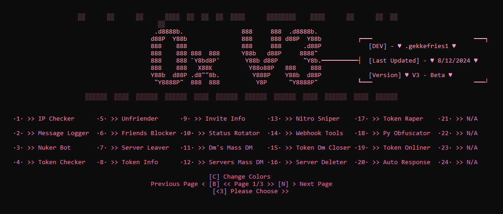

# 🌟 Discord MultiTool - Free & Open Source

 
 
 

  

## 🎉 Introduction

**Discord MultiTool** is a powerful, free, and open-source tool to perform certain tasks fast and automated. We provide full support for any kind of questions or problems.

## 🚀 Features

- **Nuker >>** Nukes any server with a Discord bot token, with user token functionality coming soon...
- **Token Options >>** Token info, message logging, auto response, sniper, and many other features...
- **Automation >>** Automate various tasks effortlessly.
- **Customization >>** Customize the console to your liking.
- **And More >>** and way way more features

## 🛠 Installation

To get 0x MultiTool, simply [**Join the Discord Server**](https://discord.gg/gRFqZFmtAy).

## 📷 Screenshot

  

## 🌐 Socials

- **Discord:** [Join our Discord Server](https://discord.gg/gRFqZFmtAy)

## ⭐ Support & Feedback

if you like this tool, please consider giving it a ⭐ star.
